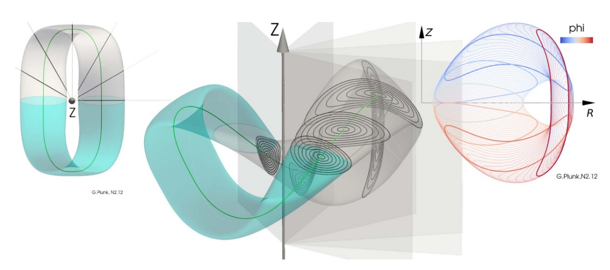
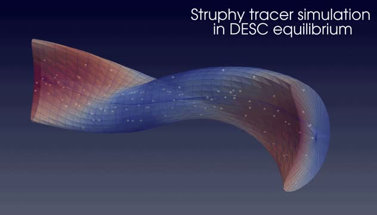
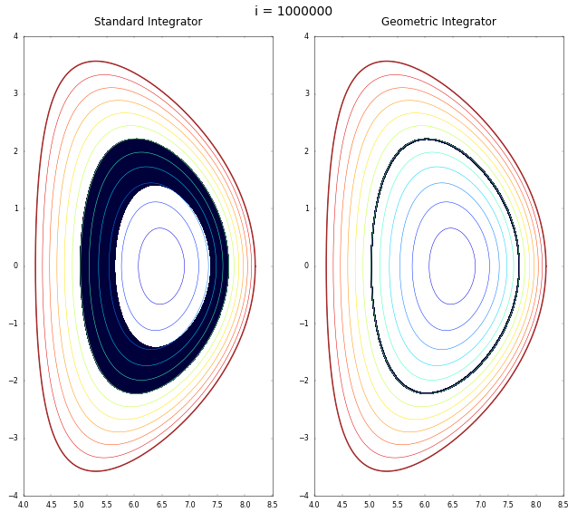

<!-- Slideshow dependencies -->
<link rel="stylesheet" href="assets/stylesheets/slideshow.css">

<!-- Slideshow Banner -->

	<button class="nmpp-arrow nmpp-arrow-left" aria-label="Previous slide">&#8592;</button>
	<button class="nmpp-arrow nmpp-arrow-right" aria-label="Next slide">&#8594;</button>
	

		
		

			

				<strong>GVEC</strong> 
				blablabla stellarator equils.
			

		

	

	

		
		

			

				<strong>Hybrid simulations</strong> 
				wow particles.
			

		

	

	

		
		

			

				<strong>Numerical Methods</strong> 
				Geometric Numerical Integration and Reduced Complexity Modelling.
			

		

	

	

		
		
		
	

## Main codes

	<a class="nmpp-card" href="codes/gempicx/">
		<strong>GEMPICX</strong>
		Description of GEMPICX.
	</a>
	<a class="nmpp-card" href="codes/gvec/">
		<strong>GVEC</strong>
		Description of GVEC.
	</a>
	<a class="nmpp-card" href="codes/struphy/">
		<strong>STRUPHY</strong>
		Description of STRUPHY.
	</a>
	<a class="nmpp-card" href="codes/psydac/">
		<strong>PSYDAC</strong>
		Description of PSYDAC.
	</a>
	<a class="nmpp-card" href="codes/geometricintegrators/">
		<strong>GeometricIntegrators.jl</strong>
		Description of GeometricIntegrators.jl.
	</a>
	<a class="nmpp-card" href="codes/hyperdeal/">
		<strong>Hyper.deal</strong>
		Description of Hyper.deal.
	</a>
	<a class="nmpp-card" href="codes/hermitegf/">
		<strong>HermiteGF.jl</strong>
		Description of HermiteGF.jl.
	</a>
	<a class="nmpp-card" href="codes/hopr/">
		<strong>HOPR</strong>
		Description of HOPR.
	</a>
	<a class="nmpp-card" href="codes/fluxo/">
		<strong>FLUXO</strong>
		Description of FLUXO.
	</a>
	<a class="nmpp-card" href="codes/bsl6d/">
		<strong>BSL6D</strong>
		Description of BSL6D.
	</a>

Check out [this page](https://nmpp-hub.github.io/codes/) for mode codes!

## Publications

    <a class="nmpp-card" href="publications/">
		<strong>Publications</strong>
		List of scientific publications.
	</a>
	<a class="nmpp-card" href="dissertations/">
		<strong>Dissertations</strong>
		List of student dissertation outputs.
	</a>

## Working groups

The division comprises six working groups:

- [Advanced Computing Hub (ACH)](https://www.ipp.mpg.de/3987588/ach)
- [Finite Element Methods (FEM)](https://www.ipp.mpg.de/5150531/fem)
- [Geometric Numerical Integration and Reduced Complexity Modelling (GNI)](https://www.ipp.mpg.de/4105128/gspm)
- [Kinetic and Gyrokinetic Models (KGKM)](https://www.ipp.mpg.de/4104717/kgkm)
- [Magnetohydrodynamics (MHD)](https://www.ipp.mpg.de/4119345/mhd)
- [Probabilistic Data Analysis and Active Learning (DAAL)](https://www.ipp.mpg.de/3989973/daal)
- [Zonal Flows in Turbulent Plasmas (ZFSFTP)](https://www.ipp.mpg.de/4171847/zfsftp)

## Links

- [NMPP's official webpage](https://www.ipp.mpg.de/ippcms/eng/for/bereiche/numerik)
